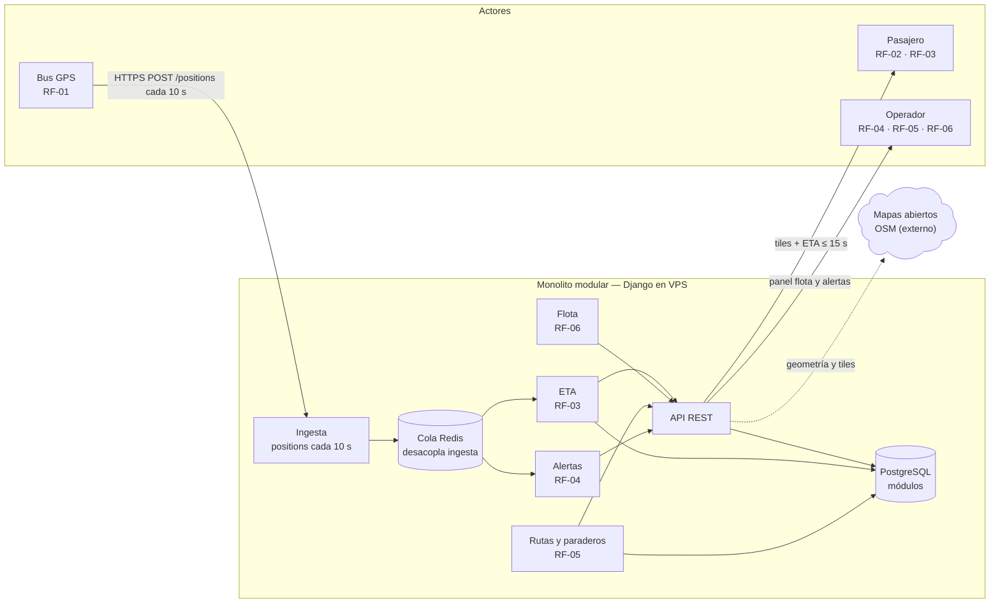

# RutaSIT Arequipa — Laboratorio 04: Fundamentos de arquitectura de software

`Construcción de Software · EPIS-UNSA · 2026-B · Grupo B`

## Integrantes

| Nombre | Rol en el laboratorio |
|--------|----------------------|
| Layme Salas, Rodrigo Fabricio | Diagramador (Mermaid / despliegue) |
| Auccacusi Conde, Brayan Carlos | Redactor de ADR |
| Castillo Lazo, Rodrigo Zarun | Verificador de IA y bitácora |

## Caso

**RutaSIT Arequipa** (caso N.º 6): seguimiento en tiempo real de los buses del
SIT de Arequipa. El pasajero ve los buses en un mapa y consulta el ETA a su
paradero; el operador recibe alertas y administra rutas. Atributo crítico:
**rendimiento en tiempo real — 300 buses envían posición cada 10 s y el ETA se
actualiza en ≤ 15 s** (30 eventos/s).

## Arquitectura elegida

Monolito modular (alternativa C, 4,20) — ver
[`docs/architecture/matriz-decision.md`](docs/architecture/matriz-decision.md) y
[ADR-001](docs/architecture/adr/001-estilo-arquitectonico.md).

Render: [`docs/architecture/diagramas/img/arquitectura.png`](docs/architecture/diagramas/img/arquitectura.png).

## Decisiones arquitectónicas

- [ADR-001](docs/architecture/adr/001-estilo-arquitectonico.md): monolito modular + cola Redis.
- [ADR-002](docs/architecture/adr/002-postgres-vs-mongo.md): PostgreSQL con esquemas por módulo.
- [ADR-003](docs/architecture/adr/003-rest-vs-cola.md): REST al borde + cola Redis interna.

## Diagramas

| Vista | Fuente | Imagen |
|-------|--------|--------|
| Arquitectura (Mermaid, E3) | `diagramas/arquitectura.mmd` | `diagramas/img/arquitectura.png` (generada con `mermaid-cli`) |
| Alternativa descartada (PlantUML, E5) | `diagramas/alternativa.puml` | `diagramas/img/alternativa.png` |
| Despliegue (Python Diagrams, E6) | `diagramas/despliegue.py` | `diagramas/img/despliegue.png` |
| Matriz (matplotlib, E2) | `diagramas/matriz_decision.py` | `diagramas/img/matriz-decision.png` |

> Nota (Plan B de la guía): esta máquina no tiene Graphviz (`dot`), por lo que
> el `.puml` y el `despliegue.py` (canonical, con `Cluster` + `Edge(label=...)`)
> se versionan como fuente y sus PNG se generaron localmente con matplotlib con
> la misma topología. Para regenerar los originales: `mmdc` para el `.mmd`,
> `java -jar plantuml.jar` (requiere Graphviz) para el `.puml`, y
> `uv run --with diagrams python despliegue.py` (requiere Graphviz).

## Reflexión sobre el uso de la IA

La IA (Muse Spark 1.3 con harness Opencode en esta fase) aceleró la redacción de
alternativas, la crítica adversarial y el esqueleto de los ADR. Pero propuso
sobredimensionar (Kafka/K8s para 30 eventos/s) e inventó supuestos (API de mapas
gratis), por lo que cada afirmación se verificó con cálculo y documentación
oficial antes de decidir. Aprendimos a pedir medidas numéricas, a desconfiar de
recomendaciones sin restricción de plazo/equipo y a registrar todo en la
[bitácora](docs/architecture/bitacora-ia.md).
